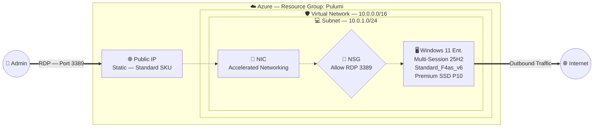

<div align="center">
  
  
  
  

  <h1>🖥️ Azure Windows 11 Enterprise VM</h1>
  <p><b>A production-ready Azure VM running Windows 11 Enterprise Multi-Session 25H2 (Gen 2), provisioned with Pulumi (Python).</b></p>
</div>

<br/>

## 🌟 Overview

This project provisions a fully configured **Windows 11 Enterprise Multi-Session 25H2 (x64 Gen 2)** Virtual Machine on Microsoft Azure using **Pulumi** with the `pulumi-azure-native` provider in Python.

It demonstrates:
- Azure VM provisioning with **Infrastructure as Code (IaC)** using Pulumi
- **Accelerated Networking** for low-latency, high-throughput networking
- **Premium SSD P10** OS disk with auto-delete on VM removal
- **Pulumi Config** for secure, encrypted credential management
- Minimal, clean Python code using native dict syntax

---

## 🏗️ Architecture Diagram



---

## 📦 Infrastructure Components

### 🌐 Networking
- **Virtual Network:** `PULUMI_VNET` — `10.0.0.0/16` isolated address space.
- **Subnet:** `PULUMI_SUBNET` — `10.0.1.0/24` for the VM workload.
- **Network Security Group:** `PULUMI_NSG` — Allows inbound RDP on TCP port `3389`.
- **Public IP:** `PULUMI_PUBLIC_IP` — Standard SKU, Static allocation.
- **Network Interface:** `PULUMI_NIC` — Bridges the subnet, NSG, and Public IP with **Accelerated Networking** enabled.

### 🖥️ Compute
- **Virtual Machine:** `PULUMI_VM` — Windows 11 Enterprise Multi-Session 25H2 (x64 Gen 2), `Standard_F4as_v6` (4 vCPUs, 8 GiB RAM, AMD EPYC™).
- **OS Disk:** `PULUMI_OS_DISK` — 128 GiB **Premium SSD (P10)**, auto-deleted on VM destruction.
- **NIC auto-delete:** Network interface is automatically removed when the VM is destroyed.

> *Note: Internal Windows hostname is `PULUMI-VM` (NetBIOS max 15 chars, no underscores).*

---

## ⚙️ Configuration

All settings are managed via **Pulumi Config** with secure defaults:

| Config Key | Default | Description |
| :--- | :--- | :--- |
| `location` | `centralindia` | Azure region |
| `admin_username` | `azureuser` | VM administrator username |
| `admin_password` | `AzureP@ssw0rd2025!` | VM administrator password *(store as secret)* |
| `vm_size` | `Standard_F4as_v6` | Azure VM SKU |

---

## 🚀 Quick Start

### Prerequisites
- **Python 3.9+**
- **Pulumi CLI** — [Install](https://www.pulumi.com/docs/install/)
- **Azure CLI** — Logged in via `az login`

### 1. Install Dependencies

```powershell
pip install -r requirements.txt
```

### 2. Login & Initialize Stack

```powershell
# Login to Pulumi
pulumi login

# Login to Azure
az login

# Create a new stack
pulumi stack init dev
```

### 3. Configure Credentials

```powershell
# Set admin username (optional, defaults to azureuser)
pulumi config set admin_username "azureuser"

# Set admin password as an encrypted secret
pulumi config set --secret admin_password "YourStrongP@ssw0rd123!"
```

### 4. Preview & Deploy

```powershell
# Preview the planned resources
pulumi preview

# Deploy the infrastructure
pulumi up
```

### 5. Access the VM

```powershell
# Get the Public IP
pulumi stack output public_ip_address

# Connect via RDP
mstsc /v:<PUBLIC_IP_ADDRESS>
```

### 6. Clean Up

```powershell
# Destroy all resources (NIC and OS disk auto-delete with the VM)
pulumi destroy
```
