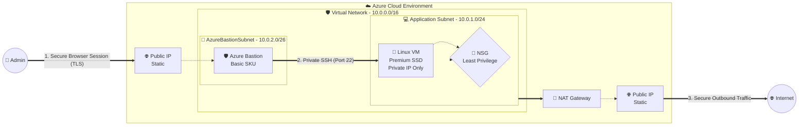

<div align="center">
  
  
  
  
  
  <h1>🛡️ Azure Enterprise VM Infrastructure</h1>
  <p><b>A highly secure, enterprise-grade Azure Linux VM architecture built with Terraform Modular IaC.</b></p>
</div>

<br/>

## 🌟 Overview

This portfolio project demonstrates a production-ready approach to deploying a Linux Virtual Machine in Microsoft Azure. Instead of a simple "VM with a Public IP," this architecture implements strict **Enterprise Security**, **Network Isolation**, and **Modular Infrastructure as Code (IaC)** principles.

It serves as a showcase of:
- Advanced Azure Networking (VNets, Subnets, NAT Gateways)
- Zero-Trust Security (No Public IPs, Azure Bastion, NSG Rules)
- Terraform Best Practices (Modularity, DRY code, Output/Variable management)

---

## 🏗️ Architecture Diagram



---

## 📦 Infrastructure Components

### 🌐 Networking
- **Virtual Network (VNet):** `10.0.0.0/16` providing isolated address space.
- **Application Subnet:** `10.0.1.0/24` exclusively for workload VMs.
- **AzureBastionSubnet:** `10.0.2.0/26` dedicated explicitly to the managed Bastion service.
- **NAT Gateway:** Attached to the App Subnet to provide a static, secure outbound IP for the VM to download packages without exposing it to inbound internet traffic.

### 🔒 Security
- **No Public IP on VM:** The Linux VM sits completely hidden from the public internet.
- **Azure Bastion:** Provides a secure, browser-based SSH jump box. Port 22 is never exposed outside the VNet.
- **Network Security Group (NSG):** Implements a strict "Deny by Default" posture.
  - *Inbound:* Only allows SSH traffic specifically from the `VirtualNetwork` service tag (which covers Bastion).
  - *Outbound:* Restricted to HTTP (80), HTTPS (443), and DNS (53).
- **SSH Key Authentication:** Password login is explicitly disabled in favor of RSA cryptography.

### 💻 Compute
- **Linux Virtual Machine:** Running Ubuntu 24.04 LTS (supported until 2029).
- **Premium Storage:** Configured with a `Premium_LRS` SSD for high-performance OS operations.
- **Burstable SKU:** Uses `Standard_B1s` for cost-effective, non-production workload simulation.

---

## 🧩 Terraform Module Structure

The codebase is strictly modularized following DRY (Don't Repeat Yourself) principles.

```text
📂 azure-enterprise-vm
├── 📄 main.tf                   # Root orchestrator — connects modules
├── 📄 variables.tf              # Global configurable inputs
├── 📄 outputs.tf                # Secure output variables
├── 📂 modules/
│   ├── 📁 network/              # VNet, Subnets, NAT Gateway & Public IPs
│   ├── 📁 security/             # NSG, Traffic Rules & Subnet Association
│   ├── 📁 bastion/              # Azure Bastion Host & Configuration
│   └── 📁 vm/                   # Linux VM, Premium SSD & NIC
└── 📂 environments/
    └── 📁 dev/
        └── 📄 terraform.tfvars  # Environment-specific configuration
```

---

## 🚀 Quick Start Guide

### 1. Prerequisites
- [Azure CLI](https://learn.microsoft.com/en-us/cli/azure/install-azure-cli) installed and authenticated (`az login`)
- [Terraform](https://developer.hashicorp.com/terraform/install) (v1.5.0+) installed
- A local SSH Key Pair (e.g., `~/.ssh/id_rsa.pub`). Generate one using: `ssh-keygen -t rsa -b 4096 -C "azure-vm"`

### 2. Configure Environment
```bash
# Copy the environment template
cp environments/dev/terraform.tfvars terraform.tfvars

# Open terraform.tfvars and ensure your SSH key path is correct:
# ssh_public_key_path = "~/.ssh/id_rsa.pub"
```

### 3. Deploy
```bash
terraform init
terraform plan
terraform apply --auto-approve
```

### 4. Connect
Because this is an enterprise architecture, **you cannot SSH directly via your terminal**.
1. Open the [Azure Portal](https://portal.azure.com)
2. Navigate to your VM (`demo-dev-vm`)
3. Click **Connect** → **Bastion**
4. Username: `azureadmin`
5. Authentication Type: **SSH Private Key from Local File**
6. Upload your private key (e.g., `~/.ssh/id_rsa`) and connect securely in your browser!

---

## 💡 Interview Cheat Sheet: "Why did you build it this way?"

If asked about this architecture in a Cloud Engineering interview, hit these key points:

> **Why did you remove the Public IP from the VM?**<br/>
> *"Direct public IPs create a massive attack surface for brute-force attacks and zero-days. By removing the public IP entirely, the VM is completely invisible to the open Internet."*

> **If it has no Public IP, how do you SSH into it?**<br/>
> *"I provisioned Azure Bastion, which acts as a Microsoft-managed jump box. It securely proxies my SSH session over TLS through the Azure Portal, meaning port 22 is never exposed outside the Virtual Network."*

> **How does the VM reach the internet to download updates?**<br/>
> *"I implemented a NAT Gateway on the application subnet. It allows the VM to make outbound connections using a shared static public IP (SNAT), but strictly blocks any unsolicited inbound traffic."*

> **Why didn't you use a Managed Identity?**<br/>
> *"Following the Principle of Least Privilege. A Managed Identity allows the VM to access Azure APIs (like Key Vault or Storage). Since this specific VM has no runtime requirement to read Azure resources, assigning an identity would unnecessarily broaden its attack surface."*

---
<div align="center">
  <i>Built for Cloud Architecture Portfolios & Technical Demonstrations</i>
</div>
